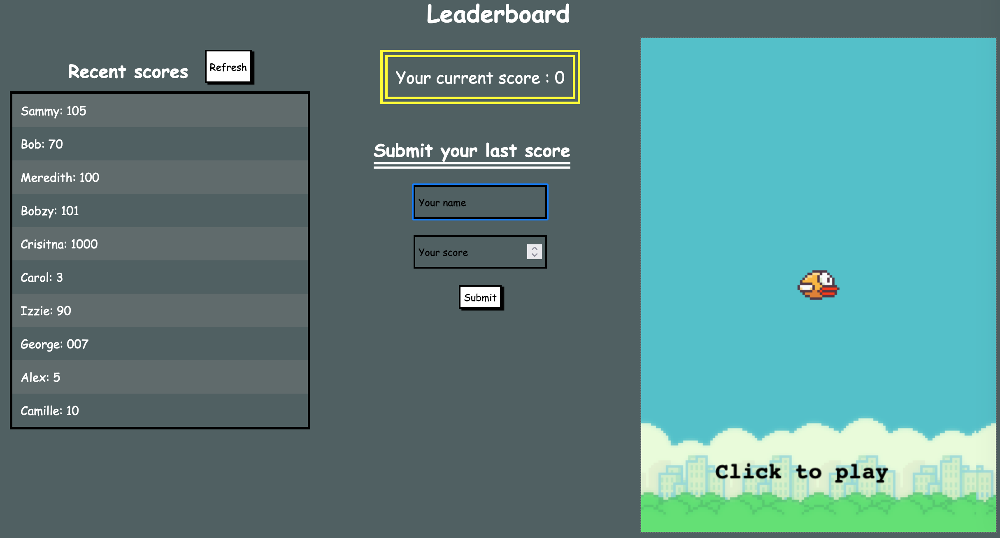

# Leaderboard

> The leaderboard website displays scores submitted by different players. It also allows you to submit your score. All data is preserved thanks to the external Leaderboard API service.



## Built With

- HTML, CSS, JS
- Webpack

## Live Demo

[Live Demo Link](https://jihaneh.github.io/Leaderboard/)

## Getting Started

To get a local copy up and running follow these simple example steps.

### Prerequisites

You need to have [NODE.JS](https://nodejs.org/en/) set up on your local machine.

### Setup

Download the project and unzip it.

### Install

Execute this command on your terminal

```
npm install
```

### Deployment

Execute this command on your terminal

```
npm start
```

It will open your browser with the project homepage

## Authors

👤 **JihaneH**

- [GitHub ](https://github.com/jihaneH)
- [Twitter](https://twitter.com/jijihaddad)
- [LinkedIn](https://linkedin.com/in/jihane-haddad/)

## 🤝 Contributing

Contributions, issues, and feature requests are welcome!

Feel free to check the [issues page](../../issues/).

## Show your support

Give a ⭐️ if you like this project!

## Acknowledgments

[Source of the Game](https://codepen.io/ju-az/pen/eYJQwLx)

## 📝 License

This project is [MIT](./MIT.md) licensed.
